# magicFlash64
## overview
The magicFlash64 is a kernal replacement for the Commodore 64 (no matter if PAL or NTSC). In total it offers 64 8KB slots (one slot has the size of one kernal) which can be used to store kernals, basic and programs. Writing slots can be done within the Commodore 64 by using a programmer application without the need to remove the Flash IC and program it on a external programmer. The magicFlash64 utilizes the flash memory AM29F040 and an Atmega48 micro controller. Originally it was planned to name the project easy kernal. Unfortunately it turned out this name was already used for a different C64 project and therefore project name magicFlash64 was born. On some PCBs you may still find the name easy kernal.
The build environment is based on gnu make Makefiles. Compiling and linking the firmware for the micro controller Atmega48 utilizes the avr-gcc compiler chain. Compiling and linking of C64 tools/kernals is based on the CC65 compiler chain. All syntax is based on these compiler chains.
## important notice for beta testers
Most critical is the communication between the microcontroller and the C64. The timing is heavily impacted by the PLA in use. Before trying to program slots please run the test program to ensure a proper working communication. In case the test program fails please do not attempt to update the firmware and program/erase any slots.

## downloads
Binary downloads can be found under releases.

## hardware
The current version of the hardware is 0.2.
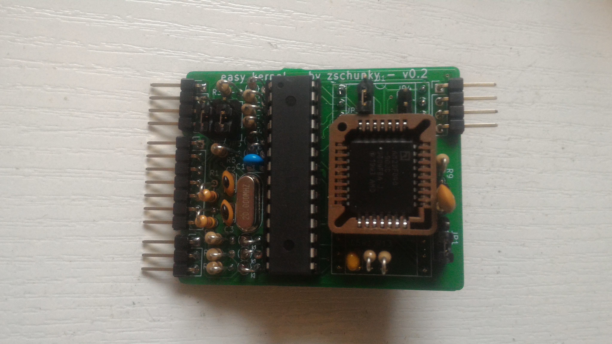 
### schematic
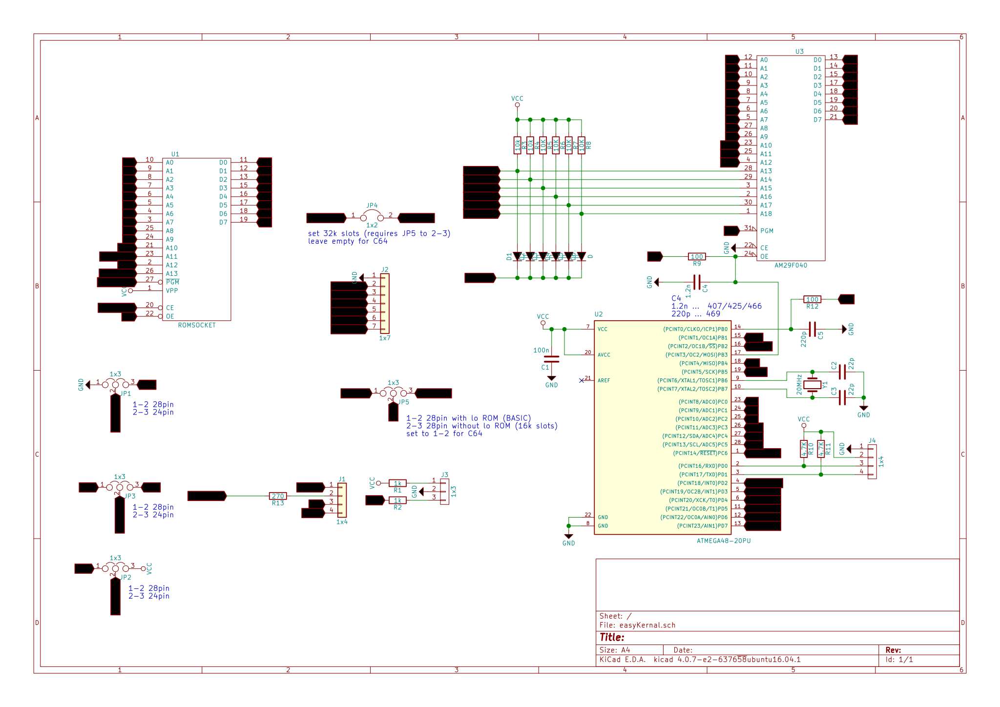
### the pcb
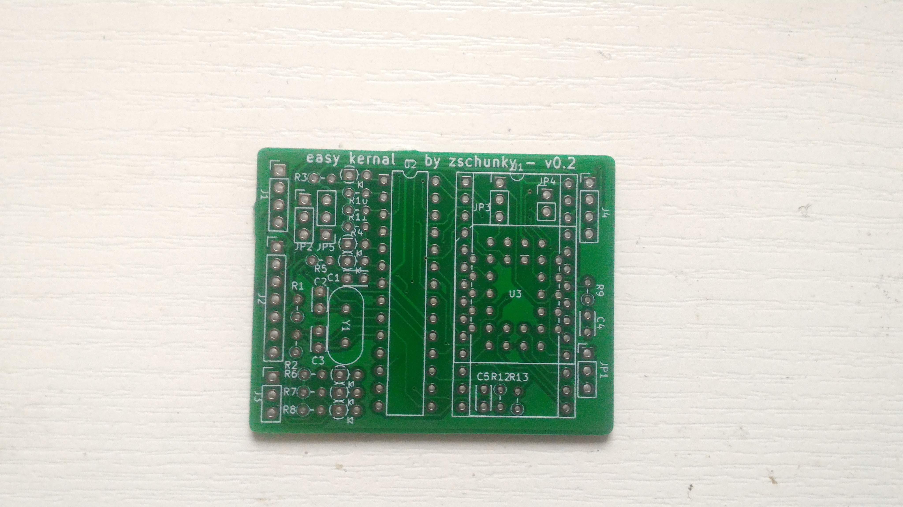 
### part list
|ID|name|housing|amount|description|vendor|
|--|----------|-------|---------|-----------|-----------------|
|1|U3|PLCC32|1|AM29F040|||
|2|C1|C_Disc_D3.4mm_W2.1mm_P2.50mm|1|100n|||
|3|C2,C3|C_Disc_D3.4mm_W2.1mm_P2.50mm|2|22p|||
|4|Y1|Crystal_HC18-U_Vertical|1|20MHz|||
|5|J2|Pin_Header_Angled_1x07_Pitch2.54mm|1|1x7|||
|6|JP1,JP2,JP3,JP5|Pin_Header_Straight_1x03_Pitch2.54mm|4|1x3|||
|7|R1,R2|R_Axial_DIN0204_L3.6mm_D1.6mm_P2.54mm_Vertical|2|1k|||
|8|R3,R4|R_Axial_DIN0204_L3.6mm_D1.6mm_P2.54mm_Vertical|2|10k|||
|9|R5,R6,R7,R8|R_Axial_DIN0204_L3.6mm_D1.6mm_P2.54mm_Vertical|4|10K|||
|10|D1,D2,D3,D4,D5,D6|D_DO-35_SOD27_P2.54mm_Vertical_AnodeUp|6|D|||
|11|JP4|Pin_Header_Straight_1x02_Pitch2.54mm|1|1x2|||
|12|U1|precision socket header|2|1x14|||
|13|U2|DIP-28_W7.62mm|1|ATMEGA48-20PU|||
|14|J4,J1|Pin_Header_Angeled_1x04_Pitch2.54mm|2|1x4|||
|15|R10,R11|R_Axial_DIN0204_L3.6mm_D1.6mm_P2.54mm_Vertical|2|4.7K|||
|16|C4|C_Disc_D3.4mm_W2.1mm_P2.50mm|1|220pF/1.2n|||
|17|C5|C_Disc_D3.4mm_W2.1mm_P2.50mm|1|220p|||
|18|R9,R12|R_Axial_DIN0204_L3.6mm_D1.6mm_P2.54mm_Vertical|2|100|||
|19|R13|R_Axial_DIN0204_L3.6mm_D1.6mm_P2.54mm_Vertical|1|270|||
|20|J3|Pin_Header_Angled_1x03_Pitch2.54mm|1|1x3|||


### soldering the pcb
As first step the male headers for the pin socket should be soldered. For better access to solder the PLCC32 socket these male headers should be trimmed a bit on the solder side before soldering them. Use a socket or breadboard to ensure these header pins are straight. 
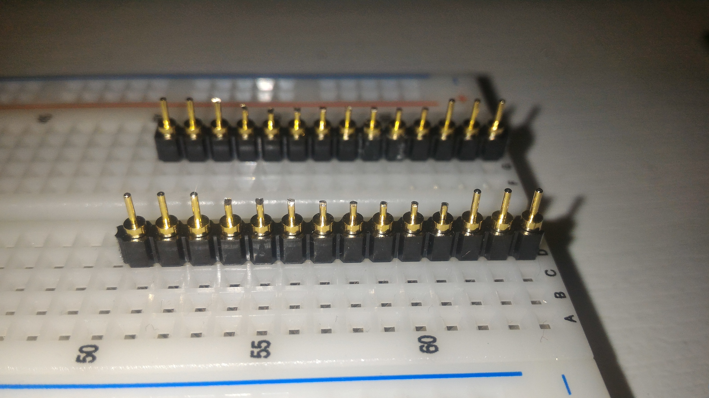 
 
Please be careful soldering these pins because the PLCC32 pin are pretty close. Make sure to not solder them together (some of these neighbor pins are connected already but most are not). As next step the PLCC32 socket should be soldered. Please also be careful here while soldering to not generate a short to the header pins. Also double check the pin 1 position of the socket before soldering.
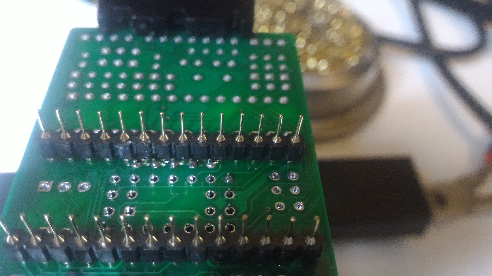 
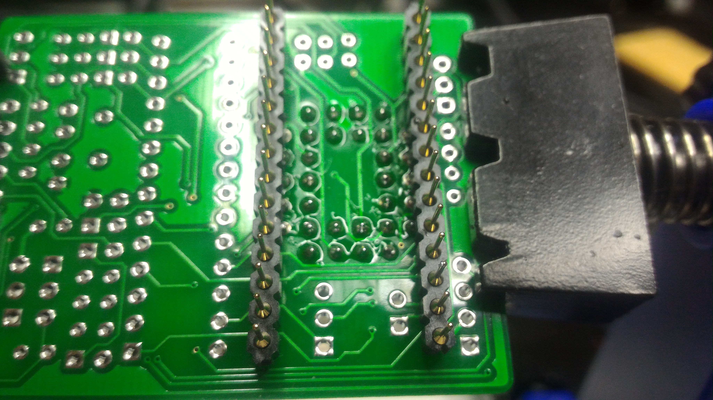 
These 2 parts are the most critical parts to solder. The rest of the parts can soldered at any desired order. 

Please pay attention for the capacitor C4 selection of PCB v0.2 (see chapter known issues/capacitor C4).
### known issues
#### capacitor C4 (PCB v0.2 only)
The capacitor C4 needs to be selected depending on the target mainboard. For 250459 mainboards use 220pF and for all others use 1.2nF. There is also the possibility to solder a precision socket instead and plug in the correct capacitor.
#### labels for J1, J2, J3 and J4
When placing angeled headers the labels for J1, J2, J3 and J4 are no longer visible.
#### keyboard mounts on 250469 boards
When installing the magicFlash64 on a 250469 mainboard in C64C case which requires keyboards mounts this will be an issue because of clearance. 3D printed mounts can be used if the left mount will be shortend.
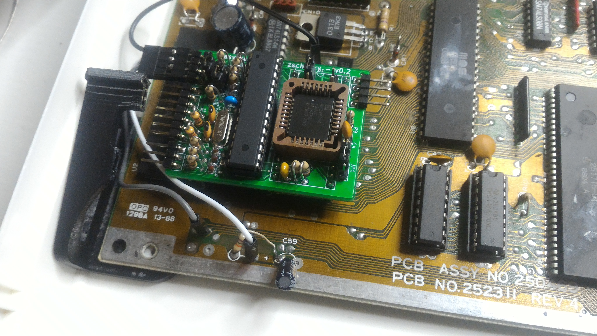 
## modes of operation
The magicFlash64 can be used in 24 pin or 28 pin kernal sockets. Jumpers will need to be set correctly depending on the used pin socket. There are also 2 ways of usage: a full populated magicFlash64 or a partly populated magicFlash64. The full populated magicFlash64 offers the possibilty to write and control the magicFlash64 via software from the Commodore 64. The partly populated magicFlash64 relies on external control via header pins (eg connected to a keyman). Modifying content of the flash memory cannot be done in partly populated mode via the Commodore 64 and the flash memory needs to be removed and programmed externally.
### 24 pin kernal replacement
Supported Commodore 64 main boards are:
- KU14194HB (not tested)
- 326298 (not tested)
- 250407
- 250425
- 250466
- 251102 (SX-64, not tested)

Following jumper settings are required to be used as 24 pin kernal replacement:
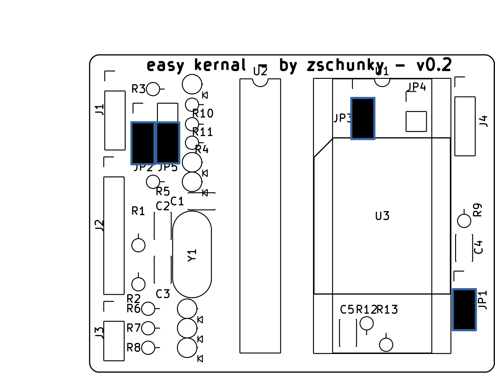 

While using the magicFlash64 on 24 pin socket the upper 2 pin rows will be outside of the socket (or shorter headers may be used during soldering).
### 28 pin kernal replacement
Supported Commodore 64 main boards are:
- 250469 (special keyboard mounts required for C64C cases with keyboard mounts)
- 310378 (C64 Rom of C128, not yet tested)

Following jumper settings are required to be used as 28 pin kernal replacement:
 

### partly populated magicFlash64
The partly populated magicFlash64 needs to be controlled from the outside via the J1 pin header. The flash content can only be modified by manual removing the flash IC and programming it with an external programmer. With this partly populated magicFlash64 the magicFlash64 may also be used in other platforms like floppy drives etc.
## preparing a C64 mainboard
In order to install a magicFlash64 on a  C64 mainboard several preparation need to be done. If the kernal ROM IC is soldered in it needs to be removed and a socket needs to be installed instead. In addition the magicFlash64 required 3 additional signals:
- restore key (available on keyboard connector pin 3)
- RW (available on any CIA pin 22)
- reset (available on any CIA pin 34)

Cables can be soldered right at these pins described above on the backside of the board or connected thru hole vias may be traced from these signals and used with male header instead. On such vias the solder needs to be removed via a desolder station or solder iron and desolder pump and then the male headers can be installed there. This allows the usage of dupont wires. These signal need to be connected to connector J1 (reset pin1, restore pin2, rw pin3)
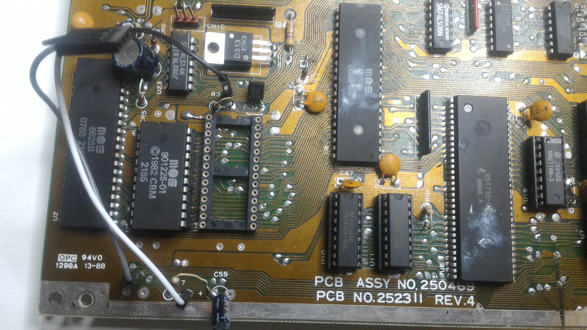 

On the connector J3 the power LED of the C64 should be plugged in. The empty slot of the plug should be placed at pin1 of J3.
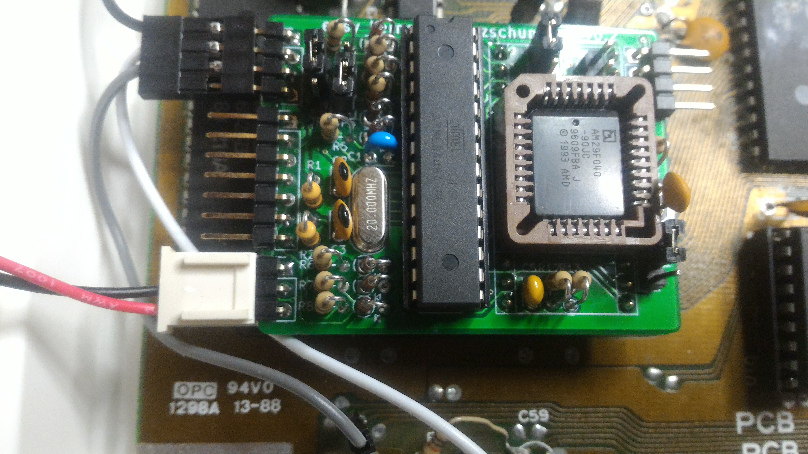 
## using the magicFlash64
When using the magicFlash64 it requires kernals to be programmed inside the FLASH memory otherwise the C64 will not boot up. In case the C64 is switched on and a blank screen is seen a bad kernal slot has been chose. You may hold the restore until it blinks and then release to select slot 63 (normally magicFlash64 menu).

The restore key can trigger some task by holding restore. While holding the first power LED will go off for 2s, then it will go back on for 2s, it will then blinks for 2s and afterwards go off again. When releasing the restore key while the LED is solid a C64 reset will trigged. When releasing the restore key while the LED blinks the kernal slot 63 will be selected and a reset will be executed.
## magicFlash64 menu
The magicFlash64 menu is a special kernal which allows you to select other kernals/carts and programs stored inside the flash of the magicFlash64. The kernal menu should be programmed in slot 63. It can be accessed in 2 ways:
- press the restore key down and hold it till the power LED blinks and release it while blinking
- press reset and hold it till the power LED blinks and release it

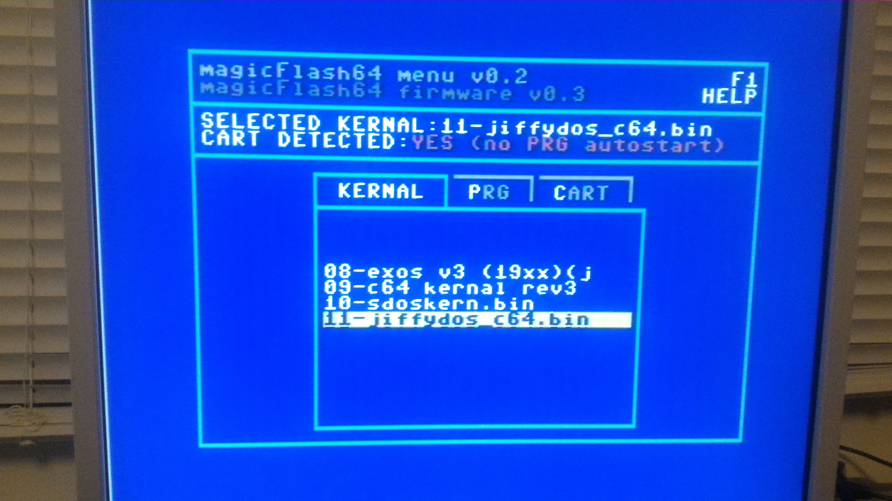 
To navigate the magicFlash64 menu use the cursor keys or the joystick (joystick not yet implemented). Cursor up/down or joystick up/down will navigate between the slots. Cursor left/right or joystick left/right will navigate between kernal/prg/cart tab. The return key or fire button will select and execute the selected slot.
For fast jumping between slots type the slot number can be typed via the number keys (always 2 key strokes are required, for slot 1 type 01).

When selecting the prg tab and executing a prg with the RETURN key the kernal which was chosen in the kernal tab will be started and in case no cartidge was detected the prg will automatically started. In case a cartidge was detected the prg file will not be auomtatically started. You will need to push the restore key to initiate the starting of prg when the basic prompt has been reached.

The magicFlash64 menu also contains a lookup table about the used/free slots of the magicFlash64.

To upgrade the magicFlash64 menu you have to use the magicFlash64 programmer application. Select slot 63 and chose program (click p). A file selection will pop up and you need to select the magicFlash64 menu binary file. Then click t and set the type to menu. Now you will need to apply these changes by clicking f7.
## magicFlash64 programmer
The magicFlash64 programmer is application to erase and program the flash memory of the magicFlash64. When the application is started it will first check all 64 slots of the magicFlash64 to make sure empty slots are erased and programmed slots match to their crc.
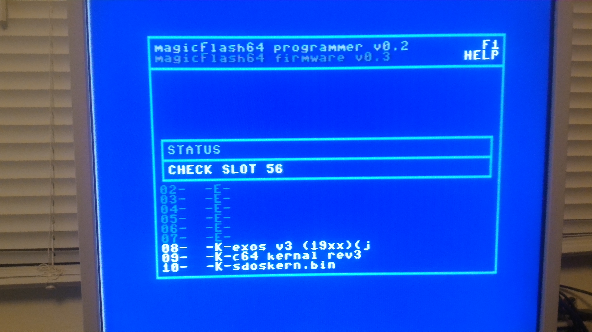 

After checking completed it will prompt you for a temporary storage device. Since the smallest erase size of the flash memory is 64 KByte (8 slots) it is requires some external storage to tempory save slots which shall not be erased. In addition a REU or GEORAM will buffer new loaded files and it will be faster when loading them into magicFlash64 (GEORAM via Ultimate 1541 II+ seems to have some issues, REU with Ultimate 1541 II+ works fine).
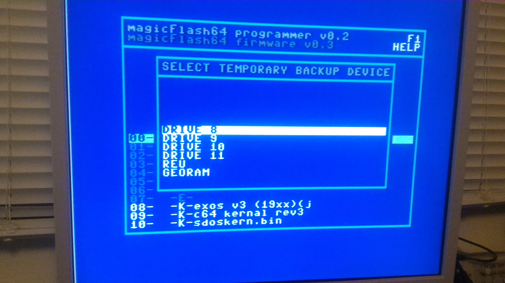 
 
Finally you will enter the main screen of the magicFlash64 programmer application.
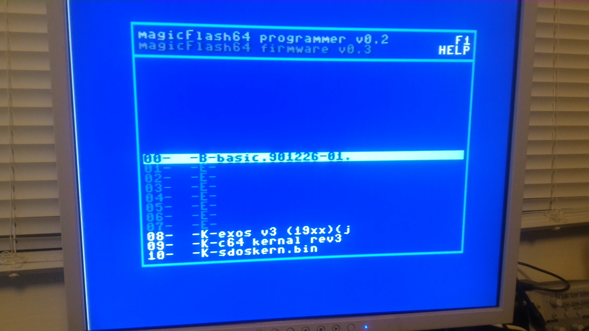 
The selection screen is split into a few columns separated by "-":

|column       |description                                                                         |
|-------------|------------------------------------------------------------------------------------|
|1            |slot number                                                                         |
|2            |action to be done (E:erase, P:program, R:reprogram)                                 |
|3            |slot type (B:basic, K:kernal, E:empty, P:program, M:menu, C:cart, +:follow up slot) |
|4            |slot name                                                                           |

Following keyboard shortcuts are available:

|key(s)       |action                                                                              |
|-------------|------------------------------------------------------------------------------------|
|up/down      |navigate up/down                                                                    |
|0-9          |fast jumping to given slot (2 key strokes are required eg 01 for slot 1)            |
|p            |mark slot to be programmed, a popup for selecting a file will come up               |
|e            |mark slot to be erased                                                              |
|d            |set slot as default boot slot (when switching on the C64 this slot will be selected)|
|cbm-8/9/0/1  |select drive 8/9/10/11 as file operation (not backup drive)                         |
|t            |change slot type                                                                    |
|v            |view first 1000 byte of the slot on the screen (click space to exit)                |
|u            |undo all changes except set default                                                 |
|f7           |apply changes                                                                       |
|b            |boot slot imediately                                                                |

The action of the d key (set default) will be imediately. All other actions need to be applied via the f7 key.
Since slots have a fixed size of 8 KByte programm are carts may be bigger than 8 KByte. For this so called follow up slots are used.

Please also pay attention to slot 63. This slot is aimed to be the magicFlash64 menu. The magicFlash64 menu will also contain a table (directory) of all kernal slots. When modifiying any slot this slot table will be updated. Also when programming slot 63 the slot table will be patched in. Do not try to program a regular kernal into this slot because the slot table will break the kernal apart.

## internals
The following articles are intendet to give some technical background on how the magicFlash64 works and how to program it.
### the micro controller
The micro controller has only a few tasks:
- monitor the restore key to perform reset or select the magicFlash64 slot for the magicFlash64 menu
- monitor the reset pin and select the magicFlash64 slot for the magicFlash64 menu if reset is hold for more than 2s (the power LED will go off for the 1st 2s and blink)
- execute commands from the C64 to select a slot, generate the write enable signal to the flash, access the micro controller eeprom, access the micro controller RAM, set the LED, ...
- communicate to C64 in both directions

#### talking to the micro controller
The micro controller has 6 IOs connected to the address bus (A12,A11,A10,A9,A8,A0) and 1 IO to the output enable signal of the kernal ROM. This allows the micro controller to check each read a access to the kernal ROM. To generate an read access with only these few address bits following macro may be used:
```
.macro STEP value
  bit $e000|((value & $3e) << 7)|(value & 1)
.endmacro
```
The micro controller checks now for a magic sequence to start an command. The magic sequence is "$00,$2A,$15,$3f,cmd" and would be translated into following C64 macro:
```
.macro SEQ cmd
  STEP $00
  STEP $2A
  STEP $15
  STEP $3F
  STEP cmd
.endmacro
```
The order of these sequence must not be interrupted by any other access to the kernal ROM (interrupts should be disabled). Such opcodes cannot be executed from the KERNAL ROM since fetching opcodes would interrupt the sequence. Additional pre caution have to be taken to bad lines of the C64. In case any of the used opcodes wants to talk to the micro controller and will run into the 1st 3 cycles of the BA signal being pulled low the 6510 cpu will generated 3 times the same read access to the kernal ROM and this will corrupt the commincation to the micro controller. 
After the magic sequence was executed an additional read on the kernal ROM will be expected with the command on the address bus (A12,A11,A10,A9,A8,A0). Certain commands require additional data via reads on the kernal ROM. To generate such read with the content of accumulator value following macro code can be used:
```
.macro STEPA
  ldx #0
  lsr
  bcc :+
  inx
:
  stx tmp1
  ora #$e0
  sta tmp2
  ldy #0
  lda (tmp1),y
.endmacro
```
#### listening to the micro controller
The communication from the micro controller to the C64 differs to the communication towards the micro controller. For this communication the micro controller invokes restore key strokes. And the C64 needs to check for this. As initial start of such communication the C64 makes a read on the KERNAL ROM at $00 (A12,A11,A10,A9,A8,A0 eg: BIT $E000) and if there is nmi interrupt happing within n ms the bit was 1 otherwise 0. All reads are byte oriented so this bit read needs to be done 8 times including the inital start at read on the KERNAL ROM at $00. To read such values from the micro controller a proper command has to be executed before.
#### programming/erasing the flash
The micro controller has an IO connected to the write enable signal of the flash device. For programming/erasing the flash the micro controller generates the required write enable signal on the flash device. This will be done by following commands issue by the C64:
>cmdWrModeAutoSelect
cmdWrModeProgram
cmdWrModeErase
cmdWrModeReset


#### commands
##### cmdLed
##### cmdReset
##### cmdSelect
##### cmdWrModeAutoSelect
##### cmdWrModeProgram
##### cmdWrModeErase
##### cmdFwUpd
##### cmdSetDefault
##### cmdGetDefault
##### cmdGetSelected
##### cmdSetEeprom
##### cmdGetEeprom
##### cmdWrModeReset
##### cmdTest
##### cmdGetPrev
##### cmdSetRam
##### cmdGetRam
##### cmdGetVersion
##### cmdMcType
